# Finals Task 1. Multi Level Company Database 
For this task, we are given MySQL statements that need to be implemented.
## Here's the screenshot of Query Statements (See screenshot)
- **TASK 1: Create a table named employees with the following fields:**
  - employee_id: Unique integer, auto-increment, primary key.
  - employee_name: String (VARCHAR) with up to 255 characters, not null
  - manager_id: Integer, foreign key referencing employee_id in the same table (employees).
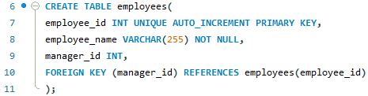
- **Task 2: Create a table named departments with the following fields:**
  - department_id: Unique integer, auto-increment, primary key.
  - department_name: String (VARCHAR) with up to 255 characters, not null.
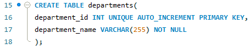
- **Task 3: Create a table named employee_departments with the following fields:**
  - employee_id: Integer, foreign key referencing employee_id in employees.
  - department_id: Integer, foreign key referencing department_id in departments.
  - Composite primary key (employee_id, department_id).
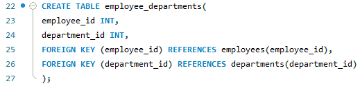
- **Task 4: Create a table named employee_projects with the following fields:**
  - employee_id: Integer, foreign key referencing employee_id in employees.
  - project_name: String (VARCHAR) with up to 255 characters, not null.
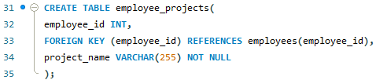
- **Task 5: Create a table named managers with the following fields:**
  - manager_id: Unique integer, auto-increment, primary key.
  - employee_id: Integer, foreign key referencing employee_id in employees.
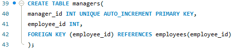
## Here's the screenshot of Table Structure (See screenshot)
- TASK 1

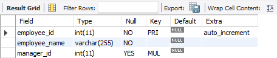
- TASK 2

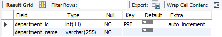
- TASK 3

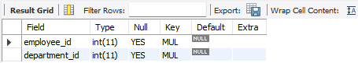
- TASK 4

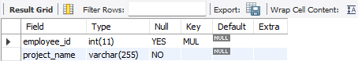
- TASK 5

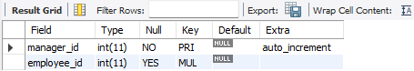
## Here's the ER Diagram or Relational schema 
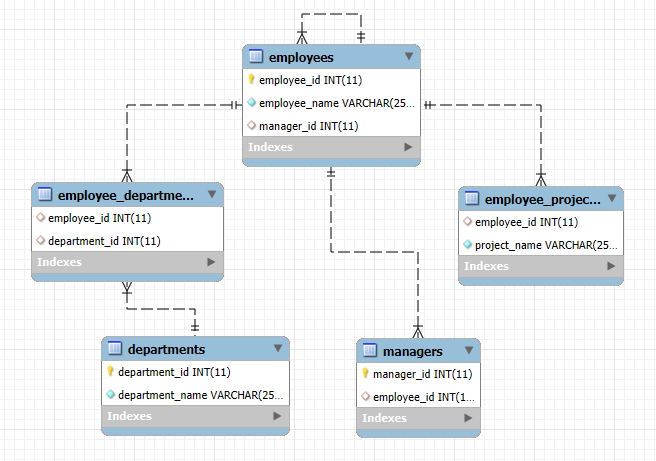
## Sql copy of the database and table structures

