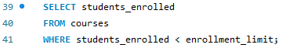
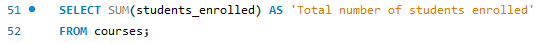
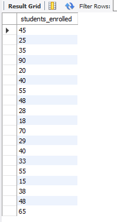

# Finals Task 4. Using SELECT CLAUSE
For this task, we are given initial query then perform the SELECT statements required for each problems.
## Here's the screenshots of Query Statements (See screenshots)
- **TASK 1**

- **TASK 2**

- **TASK 3**

- **TASK 4**

## Here's the screenshots of Table Structures (See screenshots)
- **TASK 1**

- **TASK 2**

- **TASK 3**
  

- **TASK 4**

## Here's the ER Diagram or Relational schema 

## Sql copy of the database and table structures

