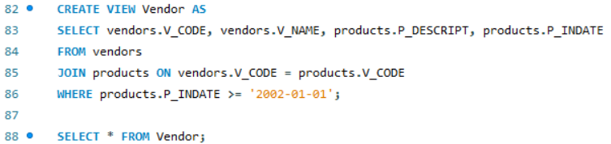
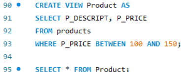
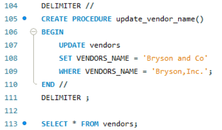
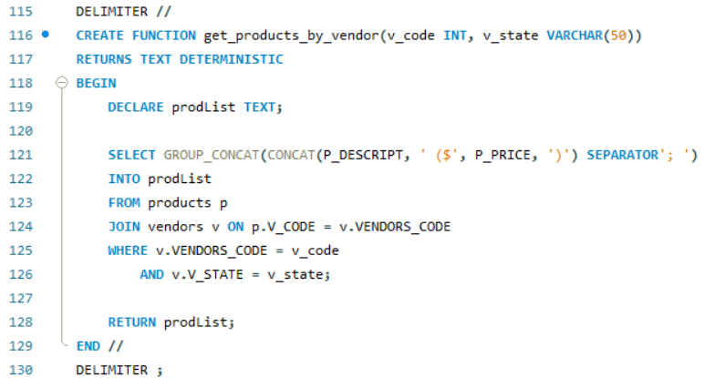
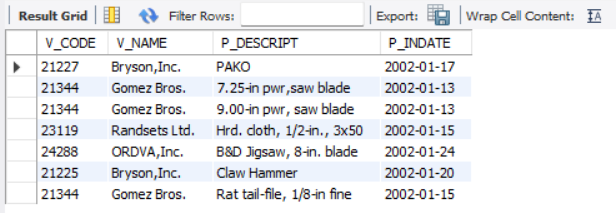
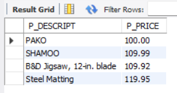
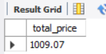
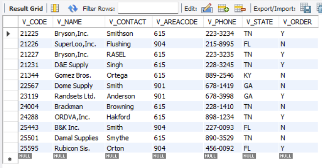

# Finals Task 5 Using SQL views and Stored Procedures and Stored Functions

## Here's the screenshot of Query Statements (See screenshots)
- **TASK 1. CREATE A VIEW that will display the vendors_code, vendors name, product description p_indate, of all products with p_indate from 2002 onwards**

- **TASK 2. CREATE a VIEW that will display all products whose price range is between 100-150**

- **TASK 3. Create a VIEW that will COMPUTE for the (TOTAL_PRICE) of ALL PRODUCTS by getting the (P_ONHAND x P_PRICE) Sold by vendors with the following v_code (21344, 23119 and 24288)**

- **TASK 4. CREATE a STORED PROCEDURE that WILL take a SINGLE PARAMETER and UPDATED the Name of Vendor ‘ ’ to ‘Bryson and Co’.**

- **TASK 5. CREATE A Function that will take 2 parameters(v_code and v_state) and display All the product description and price based on the parameters passed to the function**

## Here's the screenshot of Table Structure (See screenshots)
- **TASK 1**

- **TASK 2**

- **TASK 3**
  

- **TASK 4**

