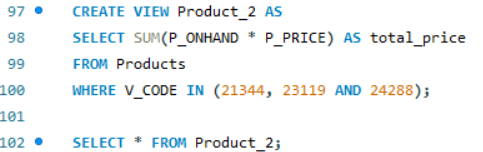

# Finals Task 5 Using SQL views and Stored Procedures and Stored Functions

## Here's the screenshot of Query Statements (See screenshots)
- **TASK 1**

- **TASK 2**

- **TASK 3**

- **TASK 4**

- **TASK 5**

## Here's the screenshot of Table Structure (See screenshots)
- **TASK 1**

- **TASK 2**

- **TASK 3**
  

- **TASK 4**

- **TASK 5**

## Sql copy of the database and table structures

