# Finals Task 6. MongoDB Practice
## Create Database
Connect to a running mongo instance, use a database named `mongo_practice`. 
use mongo_practice

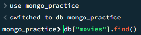
## Insert Documents
Insert the following documents into a `movies` collection.
```
title : Fight Club
writer : Chuck Palahniuk
year : 1999
actors : [
Brad Pitt
Edward Norton
]
```
```
db.movies.insert({title:"Fight Club", writer: "Chuck Palahniuk", year: "1999", actors:["Brad Pitt", "Edward Norton"]})
```
```
title : Pulp Fiction
writer : Quentin Tarantino
year : 1994
actors : [
John Travolta
Uma Thurman
]
```
```
db.movies.insert({title:"Pulp Fiction", writer:"Quentin Tarantino", year:"2009",
actors:["John Travolta", "Uma Thurman"]})
```
```
title : Inglorious Basterds
writer : Quentin Tarantino
year : 2009
actors : [
Brad Pitt
Diane Kruger
Eli Roth
]
```
```
db.movies.insert({title:"Inglorious Basterds", writer:"Quentin Tarantino", year:"2009",
actors:["Brad Pitt", "Diane Kruger", "Eli Roth"]})
```
```
title : The Hobbit: An Unexpected Journey
writer : J.R.R. Tolkein
year : 2012
franchise : The Hobbit
```
```
db.movies.insert({title:"The Hobbit: An unexpected Journey", writer:"J.R.R. Tolkein",year:"2012",franchise:"The Hobbit"})
```
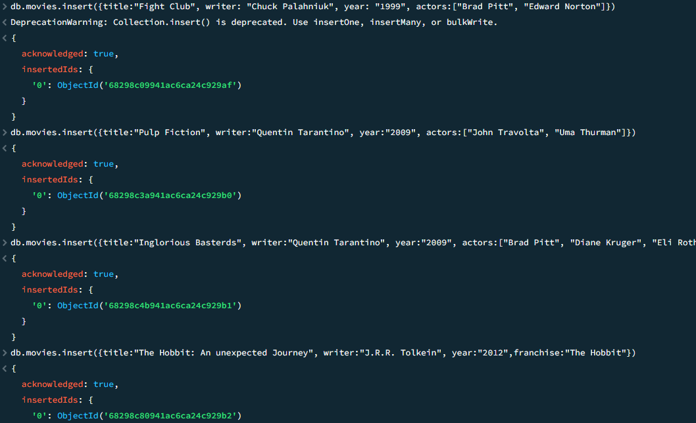
```
title : The Hobbit: The Desolation of Smaug
writer : J.R.R. Tolkein
year : 2013
franchise : The Hobbit
```
```
db.movies.insert({title:"The Hobbit: The Desolation of Smaug", writer:"J.R.R Tolkien", year:"2013", franchise:"The Hobbit"})
```
```
title : The Hobbit: The Battle of the Five Armies
writer : J.R.R. Tolkein
year : 2012
franchise : The Hobbit
synopsis : Bilbo and Company are forced to engage in a war against an array of combatants and keep the Lonely Mountain from falling into the hands of a rising darkness.
```
```
db.movies.insert({title:"The Hobbit: The Battle of the Five Armies", writer:"J.R.R Tolkien", year:"2002", franchise:"The Hobbit", synopsis:"Bilbo and Company are forced to engage in a war against an array of combatants and keep the Lonely Mountain from falling into the hands of a rising darkness."})
```
```
title : Pee Wee Herman's Big Adventure
```
```
db.movies.insert({title:"Pee Wee Herman's Big Adventures"})
```
```
title : Avatar
```
db.movies.insert({title:"Avatar"})
``

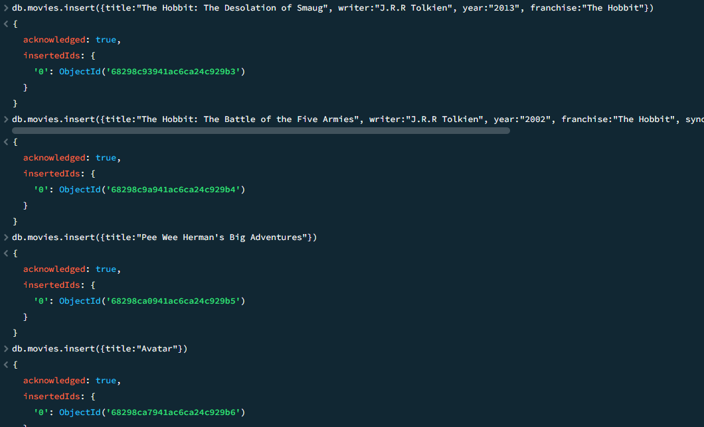
## Query / Find Documents
query the `movies` collection to

**1. get all documents**

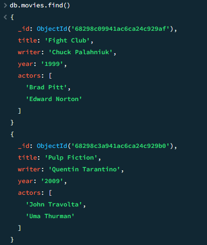

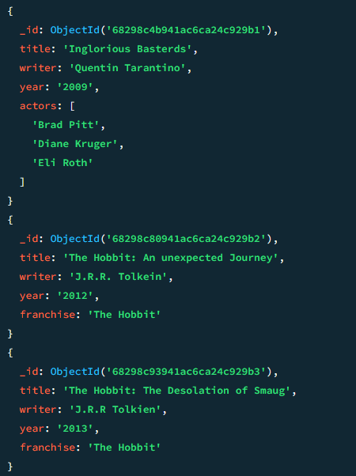

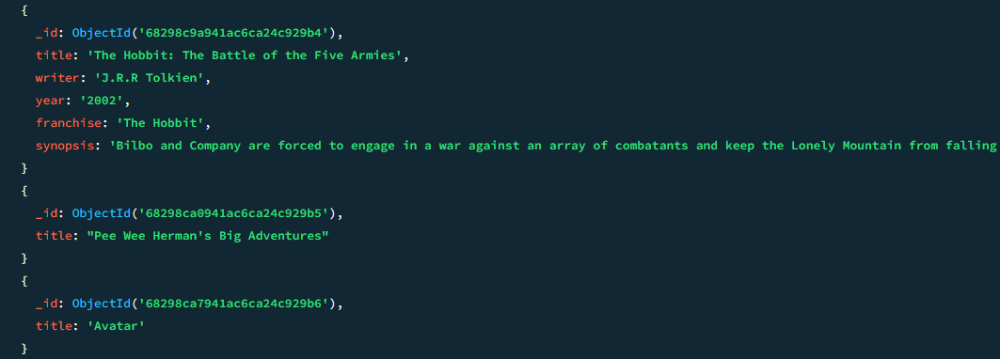
**2. get all documents with `writer` set to "Quentin Tarantino"**

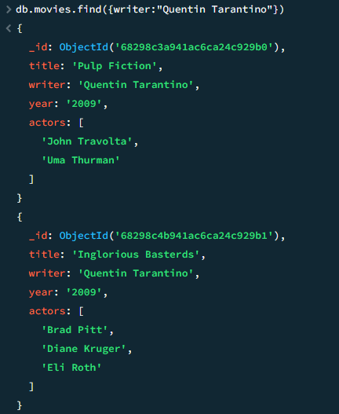
**3. get all documents where `actors` include "Brad Pitt"** 

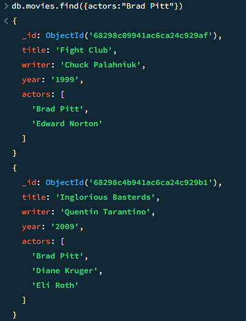
**4. get all documents with `franchise` set to "The Hobbit"**

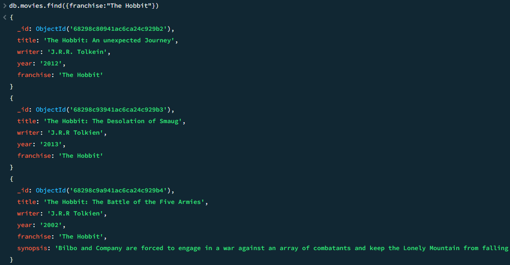
**5. get all movies released in the 90s**


**get all movies released before the year 2000 or after 2010**

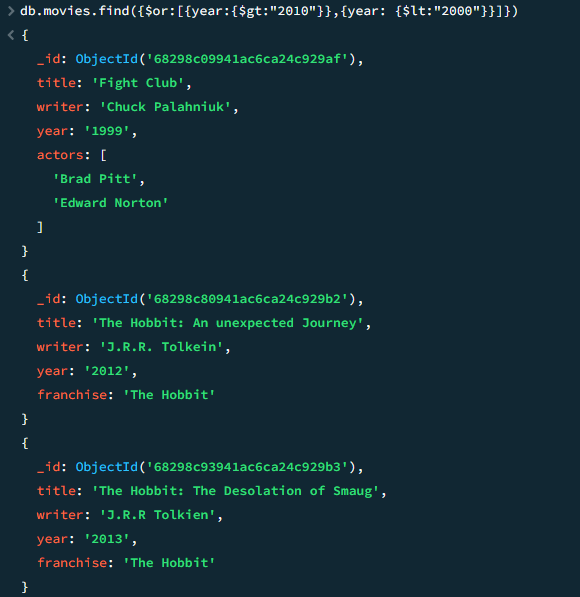
## Update Documents


## Text Search

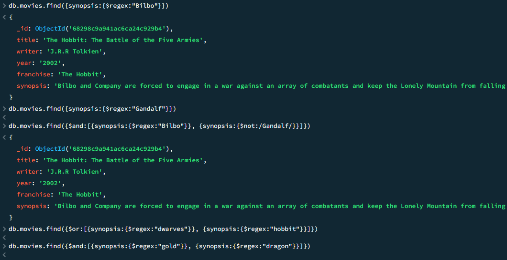
## Delete Documents

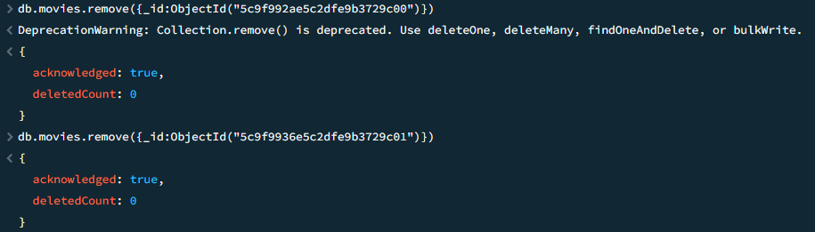
## Relationships
### Insert the following documents into a `users` collection

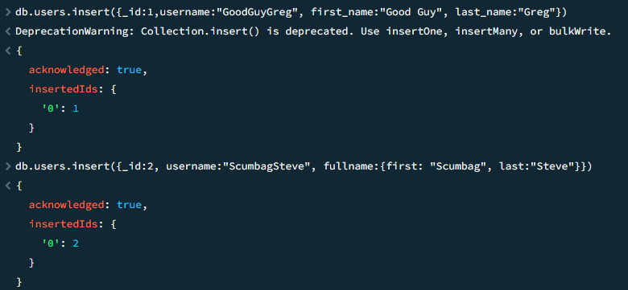
### Insert the following documents into a `posts` collection

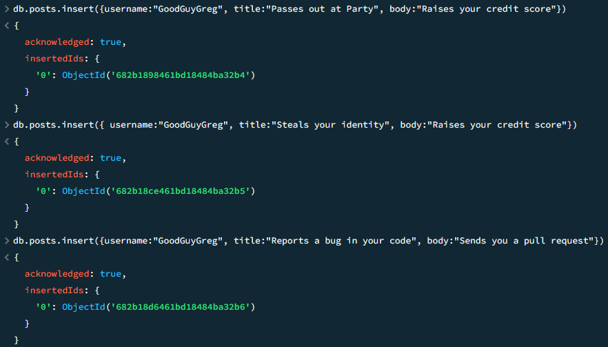
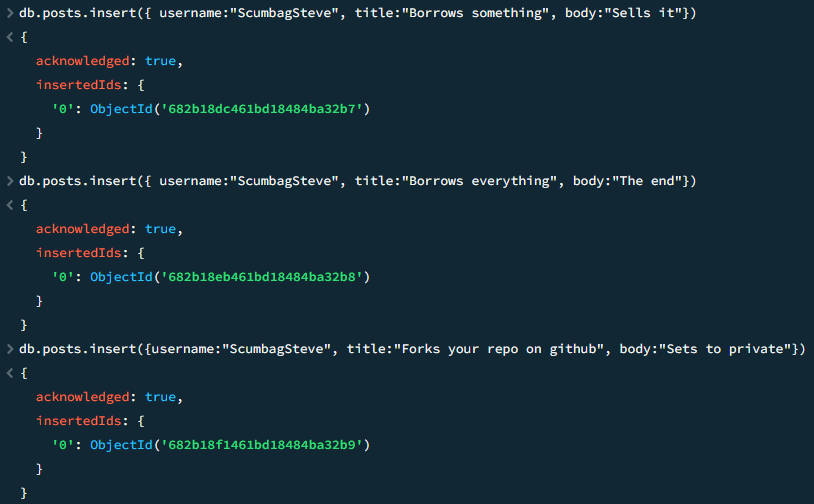
### Insert the following documents into a `comments` collection

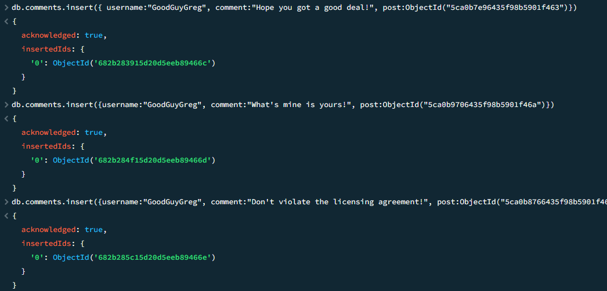
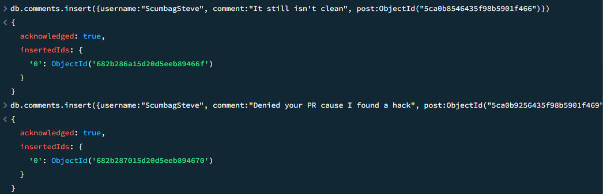
## Querying related collections
- find all users

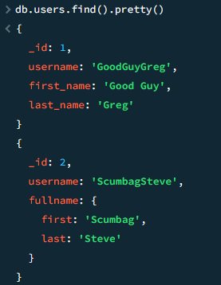
- find all posts

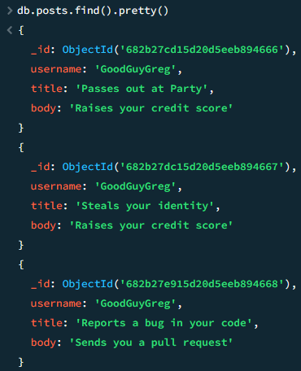
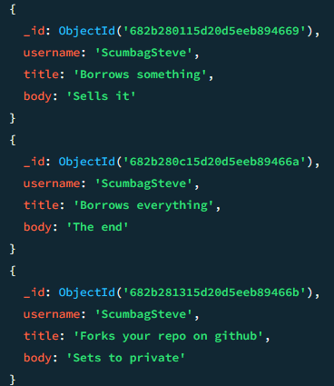
- find all posts that was authored by "GoodGuyGreg"

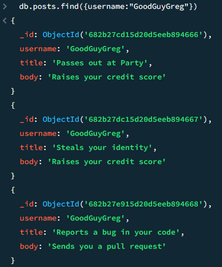
- find all posts that was authored by "ScumbagSteve"

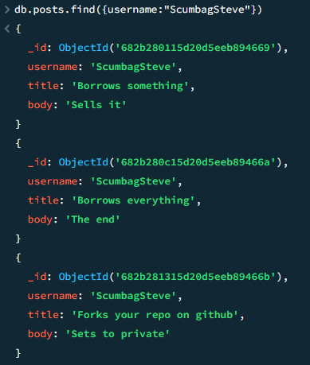
- find all comments

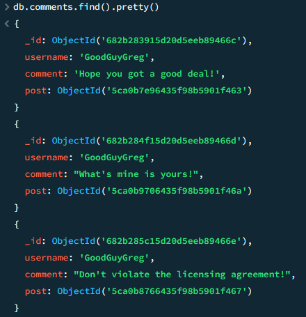
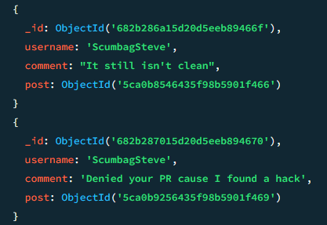
- find all comments that was authored by "GoodGuyGreg"

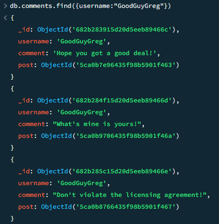
- find all comments that was authored by "ScumbagSteve"

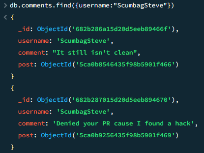

