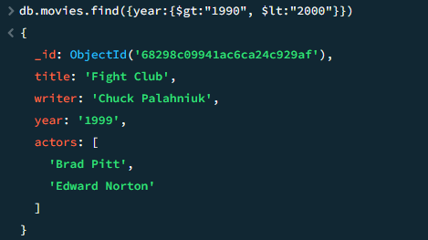

# Finals Task 6. MongoDB Practice
## Create Database

## Insert Documents
  

## Query / Find Documents
query the `movies` collection to
- db.movies.find()

- get all documents with `writer` set to "Quentin Tarantino"

- get all documents where `actors` include "Brad Pitt"

- db.movies.find({franchise:"The Hobbit"})

- db.movies.find({year:{$gt:"1990", $lt:"2000"}})

- db.movies.find({$or:[{year:{$gt:"2010"}},{year: {$lt:"2000"}}]})

## Update Documents

## Text Search

## Delete Documents

## Relationships
### Insert the following documents into a `users` collection

### Insert the following documents into a `posts` collection

### Insert the following documents into a `comments` collection

## Querying related collections
- find all users

- find all posts

- find all posts that was authored by "GoodGuyGreg"

- find all posts that was authored by "ScumbagSteve"

- find all comments

- find all comments that was authored by "GoodGuyGreg"

- find all comments that was authored by "ScumbagSteve"

